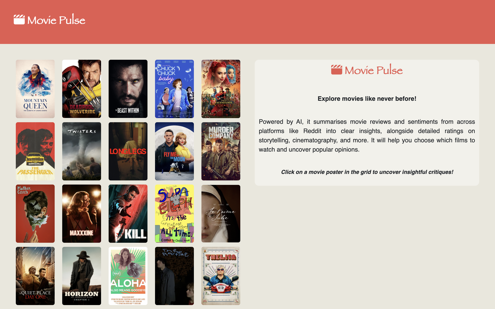

# Movie Pulse 🎬 | Movie-Review-Summarisation

Movie Pulse is an AI-powered movie review summarizer that provides concise and insightful summaries of movie reviews across various criteria like storyline, cinematography, direction, acting, dialogues, and soundtrack.

## Usage Guide 🛠️

### Adding New Movies
Fetches list of movies and reviews from The Movie Database (Hindi and English movies released in the last 90 days with at least 1 vote on TMDb).

1. **Set up TMDb API Key:**
    * Create a free TMDb account at [https://developer.themoviedb.org/docs/getting-started](https://developer.themoviedb.org/docs/getting-started).
    * Obtain your API key from your account dashboard.
    * Set the environment variable `TMDB_API_KEY` to your API key.
2. **Run the script:**
    * Install the python dependencies using the command: `pip install -r requirements.txt`
    * Run the `scrape_movies_and_reviews.py` script using the command: `python scrape_movies_and_reviews.py`.
3. **Output:**
    * The script will create two directories: `data/movies` and `data/reviews`.
    * The `data/movies/movies.json` file will contain a list of movie along with their details.
    * The `data/reviews` directory will contain individual JSON files for each movie, each file containing a list of reviews for that movie.

### Summarising Movie Reviews
Uses Cohere's chat API to summarise movie reviews.

1. **Set up Cohere API Key:**
    * Sign up for a Cohere account at [https://cohere.ai/](https://cohere.ai/).
    * Obtain your API key from your account dashboard.
    * Set the environment variable `COHERE_API_KEY` to your API key.
2. **Run the script:**
    * Run the `summarise_movie_reviews.py` script using the command: `python summarise_movie_reviews.py`.
3. **Output:**
    * The script will create a new directory `data/summarised_reviews`.
    * The directory will contain individual JSON files for each movie, each file containing the summarised review.

### Launching the Web App

1. **Run the script:**
    * Run the `main.py` script in the `webapp` directory using the command: `python webapp/main.py`.

